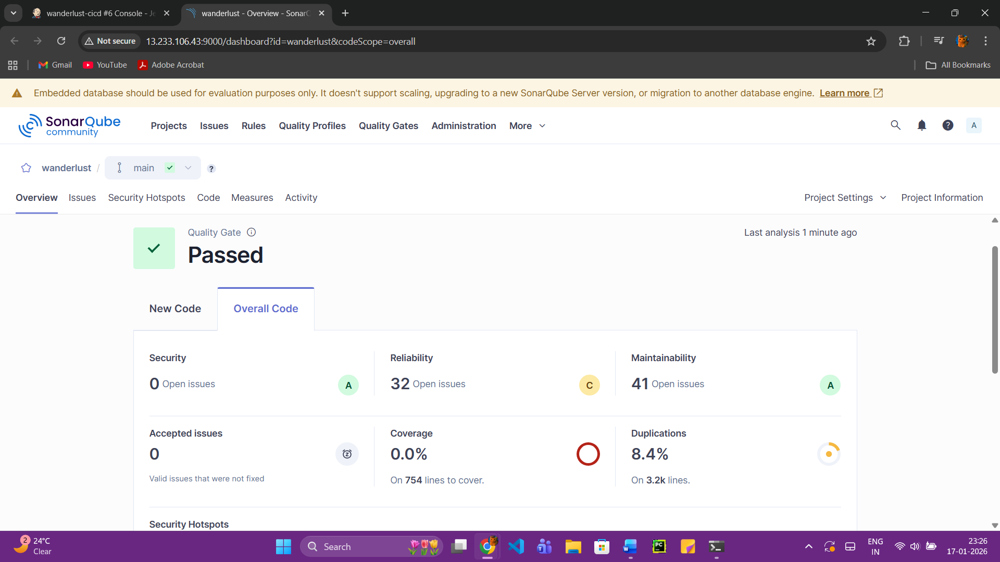
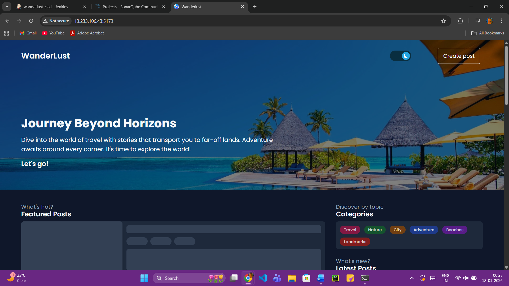

# DevSecOps Setup Guide (Jenkins + Docker + SonarQube + Trivy)

This README documents the complete setup performed on an Ubuntu EC2 instance for a CI/CD and security scanning environment.
---

### Jenkins Pipeline Result


---

## 🚀 Final Result



## ✅ System Details

* **OS:** Ubuntu 24.04 LTS

---

## 🔧 Installed Components

### 1️⃣ Docker Installation

```bash
sudo apt update
sudo apt-get install docker.io -y
```

Add user to docker group:

```bash
sudo usermod -aG docker $USER && newgrp docker
```

Verify Docker:

```bash
docker ps
```

---

### 2️⃣ Install Java (Required for Jenkins & SonarQube)

```bash
sudo apt install fontconfig openjdk-21-jre -y
java -version
```

---

### 3️⃣ Jenkins Installation

Add Jenkins repository:

```bash
sudo wget -O /etc/apt/keyrings/jenkins-keyring.asc \
  https://pkg.jenkins.io/debian-stable/jenkins.io-2023.key

echo "deb [signed-by=/etc/apt/keyrings/jenkins-keyring.asc] \
https://pkg.jenkins.io/debian-stable binary/" | \
sudo tee /etc/apt/sources.list.d/jenkins.list
```

Install Jenkins:

```bash
sudo apt update
sudo apt install jenkins -y
```

Get initial admin password:

```bash
sudo cat /var/lib/jenkins/secrets/initialAdminPassword
```

Restart Jenkins (after docker permission change later):

```bash
sudo systemctl restart jenkins
```

Add Jenkins to docker group:

```bash
sudo usermod -aG docker jenkins
sudo systemctl restart jenkins
```

---

### 4️⃣ SonarQube Setup (Docker)

Run SonarQube Community edition:

```bash
docker run -itd --name SonarQube-Server -p 9000:9000 sonarqube:community
```

Check status:

```bash
docker ps
```

Check SonarQube health:

```bash
curl http://13.233.106.43:9000/api/system/status
```

Expected response when ready:

```json
{"status":"UP"}
```

---

### 5️⃣ Trivy Installation (Security Scanner)

Add Trivy repo and install:

```bash
wget -qO - https://aquasecurity.github.io/trivy-repo/deb/public.key | sudo apt-key add -

echo deb https://aquasecurity.github.io/trivy-repo/deb $(lsb_release -sc) main | \
sudo tee -a /etc/apt/sources.list.d/trivy.list

sudo apt update
sudo apt-get install trivy -y
```

Verify:

```bash
trivy --version
```

---

### 6️⃣ Docker Compose Installation

```bash
sudo apt-get install docker-compose -y
```

Verify:

```bash
docker-compose version
```

---

## 🚀 Final Environment

| Tool           | Purpose                          |
| -------------- | -------------------------------- |
| Docker         | Container runtime                |
| Docker Compose | Multi-container management       |
| Jenkins        | CI/CD automation                 |
| SonarQube      | Code quality & security analysis |
| Trivy          | Vulnerability scanning           |

---

## 📌 Notes

* Jenkins has permission to run Docker commands
* SonarQube runs on port **9000**
* Trivy is installed system-wide
* Docker Compose is available for deployments

---

## 👤 Maintained by

**Ram Kumar Prajapati**


